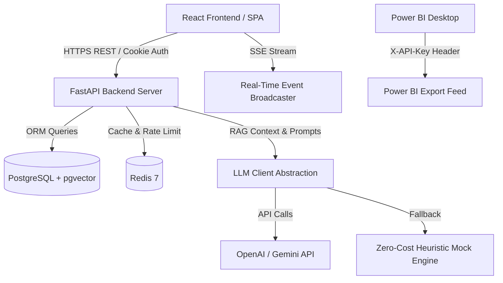

# Riskline Architecture & Technical Design

This document describes the production architecture of **Riskline**, built over a 7-day development cycle.

---

## 1. High-Level System Architecture

---

## 2. Core Architectural Components

### A. Multi-Tenant Relational Schema (`OrgScopedMixin`)
Every tenant model (except system users) inherits `OrgScopedMixin`, which defines `org_id = Column(UUID, ForeignKey('organizations.id'), nullable=False, index=True)`.
All repository queries explicitly filter `WHERE org_id == current_user.org_id` to guarantee zero cross-tenant data leakage.

### B. AI Risk Engine & RAG Vector Pipeline (`risk_engine.py`, `embedding_service.py`)
1. **Document Chunking**: Sliding window (800 chars, 150 overlap).
2. **Embeddings**: `text-embedding-3-small` (1536 dims) when OpenAI API key is configured; deterministic 1536-dimensional Hash-Vectorizer fallback for CI/mock execution.
3. **pgvector Storage**: `ChangeEmbedding` model stores vector embeddings with HNSW cosine distance indexing (`vector_cosine_ops`). Vector searches strictly enforce `WHERE org_id == current_user.org_id`.
4. **LLM Client Abstraction**: Supports OpenAI (`gpt-4o-mini`), Gemini (`gemini-1.5-flash`), and Mock fallback with Pydantic structured output validation (`RiskAnalysisOutput`). Retries twice before falling back gracefully to mock heuristic mode (`is_degraded = True`).

### C. Streaming SSE Chatbot (`chat_service.py`)
- Token-by-token streaming via Server-Sent Events (`POST /api/v1/chat/stream`).
- Audience translation modes: `technical` (SRE focus), `business` (Exec focus), and `auto-detect`.
- Contextual grounding via historical RAG chunk retrieval.

### D. Real-Time Org Event Broadcaster (`events.py`)
- In-memory pub/sub event queue (`EventBroadcaster`) delivering tenant-isolated SSE events to connected web clients (`GET /api/v1/events/stream`).

### E. Power BI Export Integration (`export.py`, `api_key.py`)
- Read-only API Key issuance (`POST /api/v1/export/api-keys`). Secret key hashed via SHA-256 in DB.
- Tabular export endpoint (`GET /api/v1/export/power-bi`) designed for Power BI Desktop scheduled refresh.

---

## 3. Database Models Summary

- **`Organization`**: `id`, `name`, `slug`, `plan`, `created_at`.
- **`User`**: `id`, `org_id`, `email`, `hashed_password`, `role` (`admin`, `engineer`, `business_ops`, `viewer`), `status`.
- **`TeamMember`**: Roster information and invitation status.
- **`Change`**: Deployment titles, descriptions, risk scores, and status (`pending`, `analyzed`, `deployed`).
- **`RiskAnalysis`**: Structured technical & business summaries, recommendations list, risk level (`low`, `medium`, `high`, `critical`).
- **`ChangeEmbedding`**: Vector embedding chunks for RAG search.
- **`Note`**: Brainstorm board entries with tag categories (`idea`, `blocker`, `decision`, `question`).
- **`ProjectProgress`**: Project milestones and progress percentages.
- **`Notification` & `NotificationPreference`**: In-app and external alert triggers.
- **`ApiKey`**: SHA-256 hashed keys for Power BI integrations.
- **`PasswordResetToken`**: Single-use, 1-hour expiration reset tokens.
- **`AuditLog`**: Immutable log of all system mutations and authentication events.
